# Отчет по лабораторной работе: Бинарное дерево поиска на Qt

## Описание проекта

Данный проект представляет собой графическое приложение на **C++** с использованием фреймворка **Qt**, реализующее **бинарное дерево поиска (BST — Binary Search Tree)** с визуализацией и демонстрационным режимом пошагового выполнения операций.

---

## Постановка задачи

### Цель работы
Разработать программное обеспечение для визуализации работы бинарного дерева поиска с возможностью интерактивного управления и демонстрации алгоритмов в пошаговом режиме.

### Задачи
1. Реализовать структуру данных «бинарное дерево поиска» для хранения строковых значений
2. Обеспечить выполнение основных операций над деревом:
   - Вставка нового элемента
   - Удаление существующего элемента
   - Поиск элемента по значению
   - Подсчёт элементов по заданному префиксу
3. Реализовать три классических способа обхода дерева:
   - Прямой (preorder)
   - Симметричный (inorder)
   - Обратный (postorder)
4. Разработать алгоритм балансировки дерева для обеспечения оптимальной высоты
5. Создать графический интерфейс пользователя для взаимодействия с деревом
6. Реализовать визуальное отображение структуры дерева в реальном времени
7. Внедрить демонстрационный режим с пошаговой анимацией выполнения операций
8. Обеспечить поддержку UTF-8 кодировки для работы с русскоязычными данными

### Требования к функционалу
- **Обязательные**: CRUD-операции, обходы, визуализация
- **Дополнительные**: демо-режим, балансировка, статистика дерева

---

## Анализ задачи

### Выбор структуры данных
Для решения поставленной задачи выбрано **бинарное дерево поиска (BST)** по следующим причинам:
- Обеспечивает эффективный поиск в среднем за O(log n)
- Поддерживает упорядоченное хранение данных
- Позволяет легко реализовать обходы различной направленности
- Является фундаментальной структурой для изучения алгоритмов на деревьях

### Архитектурные решения

#### 1. Разделение ответственности
Проект разделён на три логических модуля:
- **Модель данных** (`BSTree`) — инкапсулирует логику работы с деревом
- **Представление** (`TreeWidget`) — отвечает за графическую отрисовку
- **Контроллер** (`MainWindow`) — управляет взаимодействием пользователя с системой

Такая архитектура соответствует паттерну **Model-View-Controller (MVC)** и обеспечивает:
- Низкую связность между компонентами
- Высокую сопровождаемость кода
- Возможность независимого тестирования модулей

#### 2. Выбор технологий
| Компонент | Технология | Обоснование |
|-----------|-----------|-------------|
| Язык | C++17 | Производительность, контроль памяти, поддержка современных возможностей |
| GUI-фреймворк | Qt Widgets | Кроссплатформенность, богатый набор компонентов, хорошая документация |
| Система сборки | CMake | Стандарт де-факто для C++ проектов, гибкость конфигурации |

#### 3. Особенности реализации

**Управление памятью:**
- Ручное управление памятью через `new`/`delete`
- Глубокое копирование строк через `char*`
- Обязательная очистка памяти в деструкторе

**Демо-режим:**
- Использование вектора `StepInfo` для хранения истории операций
- Каждый шаг содержит метаданные: описание, подсвеченные узлы, тип операции
- Позволяет «отматывать» операции назад для образовательных целей

**Визуализация:**
- Рекурсивный алгоритм размещения узлов по уровням
- Автоматический расчёт координат на основе глубины узла
- Отрисовка связей линиями между родительскими и дочерними узлами

### Сложности и их решение

| Проблема | Решение |
|----------|---------|
| Дубликаты в дереве | Запрет вставки повторяющихся значений |
| Вырожденное дерево | Реализация балансировки через построение из отсортированного массива |
| Отображение длинных строк | Использование UTF-8 и корректная конвертация между `QString` и `char*` |
| Переполнение стека при рекурсии | Ограничение глубины рекурсии высотой дерева (O(log n) для сбалансированного) |

### Оценка сложности алгоритмов

| Операция | Средняя сложность | Худшая сложность |
|----------|------------------|------------------|
| Вставка | O(log n) | O(n) |
| Удаление | O(log n) | O(n) |
| Поиск | O(log n) | O(n) |
| Обход | O(n) | O(n) |
| Балансировка | O(n) | O(n) |
| Высота | O(n) | O(n) |

*Примечание: худшая сложность достигается на вырожденном дереве; балансировка устраняет эту проблему.*

---

## Структура проекта

```
/workspace
├── CMakeLists.txt        # Файл сборки CMake
├── main.cpp              # Точка входа в приложение
├── binarytree.h          # Заголовочный файл класса бинарного дерева
├── binarytree.cpp        # Реализация класса бинарного дерева
├── treewidget.h          # Заголовочный файл виджета отрисовки дерева
├── treewidget.cpp        # Реализация виджета отрисовки дерева
├── mainwindow.h          # Заголовочный файл главного окна
├── mainwindow.cpp        # Реализация главного окна приложения
└── README.md             # Документация (этот файл)
```

---

## Технические характеристики

### Используемые технологии
- **Язык программирования**: C++17
- **Фреймворк**: Qt5 (минимум 5.15) / Qt6
- **Система сборки**: CMake (минимум 3.16)
- **Модули Qt**: Qt Widgets

### Архитектура приложения

#### 1. Класс `BSTree` (binarytree.h/cpp)
Основной класс, реализующий бинарное дерево поиска со следующими возможностями:

**Основные операции:**
- `insert(const QString& value)` — вставка элемента
- `remove(const QString& value)` — удаление элемента
- `contains(const QString& value)` — поиск элемента
- `clear()` — очистка дерева

**Метрики дерева:**
- `height()` — вычисление высоты дерева
- `countNodes()` — подсчёт количества узлов
- `countStartsWith(QChar ch)` — подсчёт элементов, начинающихся с заданного символа

**Обходы дерева:**
- `preorder()` — прямой обход (корень-левый-правый)
- `inorder()` — симметричный обход (левый-корень-правый)
- `postorder()` — обратный обход (левый-правый-корень)

**Вывод дерева:**
- `verticalPrint()` — вертикальное представление
- `horizontalPrint()` — горизонтальное представление

**Балансировка:**
- `balance()` — балансировка дерева (построение сбалансированного дерева из отсортированной последовательности)

**Демонстрационный режим:**
- `setDemoMode(bool)` — включение/выключение демо-режима
- `setCurrentStep(int)` — установка текущего шага демонстрации
- `getStep(int)` — получение информации о шаге
- Поддержка пошаговой визуализации операций

#### 2. Класс `TreeWidget` (treewidget.h/cpp)
Виджет для графической отрисовки дерева:

- Автоматическое размещение узлов на основе их глубины
- Отрисовка связей между узлами
- Подсветка активных и модифицированных узлов в демо-режиме
- Отображение описания текущего шага операции

#### 3. Класс `MainWindow` (mainwindow.h/cpp)
Главное окно приложения с пользовательским интерфейсом:

**Элементы управления:**
- Поле ввода элемента для вставки/удаления/поиска
- Поле ввода символа для подсчёта элементов по префиксу
- Кнопки операций:
  - **Вставить** — добавление элемента в дерево
  - **Удалить** — удаление элемента из дерева
  - **Поиск** — проверка наличия элемента
  - **Посчитать по символу** — подсчёт элементов на заданную букву
  - **Прямой/Симметричный/Обратный обход** — traversal операции
  - **Вертикальная/Горизонтальная печать** — текстовое представление
  - **Балансировка** — сбалансировать дерево
  - **Пример дерева** — заполнение тестовыми данными
  - **Очистить** — удалить все элементы


# UML-диаграмма классов проекта "Бинарное дерево поиска на Qt"

## Общая архитектура

Проект реализует паттерн **Model-View-Controller (MVC)**:
- **Model**: `BSTree` — модель данных бинарного дерева
- **View**: `TreeWidget` — компонент визуализации
- **Controller**: `MainWindow` — управление взаимодействием пользователя

---

## UML-диаграмма классов

```mermaid
classDiagram
    %% Структуры данных
    class Node {
        +char* data
        +Node* left
        +Node* right
        +Node(char* s)
    }

    class StepInfo {
        +QString description
        +QVector~const Node*~ highlightedNodes
        +QVector~const Node*~ modifiedNodes
        +const Node* currentNode
        +int operationType
    }

    %% Модель данных
    class BSTree {
        -Node* m_root
        -bool m_demoMode
        -int m_currentStep
        -QVector~StepInfo~ m_steps
        +BSTree()
        +~BSTree()
        +Node* root() const
        +void clear()
        +bool insert(const QString& value)
        +bool remove(const QString& value)
        +bool contains(const QString& value) const
        +int countStartsWith(QChar ch) const
        +int height() const
        +int countNodes() const
        +String preorder() const
        +String inorder() const
        +String postorder() const
        +String verticalPrint() const
        +String horizontalPrint() const
        +void balance()
        +void setDemoMode(bool enabled)
        +bool isDemoMode() const
        +void setCurrentStep(int step)
        +int currentStep() const
        +int totalSteps() const
        +const StepInfo& getStep(int index) const
        +void clearSteps()
        -static char* dupUtf8(const QString& s)
        -static String fromUtf8(const char* s)
        -static int cmp(const char* a, const QString& b)
        -static void destroy(Node* n)
        -static Node* insert(Node* n, const QString& value, bool& inserted)
        -static Node* remove(Node* n, const QString& value, bool& removed)
        -static Node* minNode(Node* n)
        -static bool contains(Node* n, const QString& value)
        -static void preorder(Node* n, QStringList& out)
        -static void inorder(Node* n, QStringList& out)
        -static void postorder(Node* n, QStringList& out)
        -static int height(Node* n)
        -static int countNodes(Node* n)
        -static int countStartsWith(Node* n, QChar ch)
        -static void collectInorder(Node* n, QVector~String~& vals)
        -static Node* buildBalanced(const QVector~String~& vals, int l, int r)
        -static void horizontalPrint(Node* n, int depth, QStringList& out)
        -void addStep(...)
        -Node* insertDemo(Node* n, const QString& value, bool& inserted)
        -Node* removeDemo(Node* n, const QString& value, bool& removed)
        -bool containsDemo(Node* n, const QString& value)
        -void balanceDemo()
    }

    %% Представление
    class TreeWidget {
        -BSTree* m_tree
        -QMap~const Node*, QPointF~ m_pos
        -bool m_demoMode
        -int m_currentStep
        -int m_totalSteps
        -QSet~const Node*~ m_highlightedNodes
        -QSet~const Node*~ m_modifiedNodes
        -const Node* m_currentNode
        -String m_stepDescription
        -int m_operationType
        +TreeWidget(QWidget* parent)
        +void setTree(BSTree* tree)
        +void setDemoMode(bool enabled)
        +void setCurrentStep(int step)
        +int currentStep() const
        +int totalSteps() const
        +stepChanged(int step)*
        +demoFinished()*
        #void paintEvent(QPaintEvent* event)
        #void resizeEvent(QResizeEvent* event)
        #void mousePressEvent(QMouseEvent* event)
        -void updateLayout()
        -void assignPos(...)
        -void drawEdges(QPainter& painter, const Node* node)
        -void drawNodes(QPainter& painter, const Node* node)
        -void updateFromStep()
    }

    %% Контроллер
    class MainWindow {
        -BSTree* m_tree
        -TreeWidget* m_treeWidget
        -QLineEdit* m_valueEdit
        -QLineEdit* m_prefixEdit
        -QTextEdit* m_output
        -QCheckBox* m_demoModeCheck
        -QPushButton* m_prevStepBtn
        -QPushButton* m_nextStepBtn
        -QPushButton* m_playBtn
        -QSlider* m_stepSlider
        -QLabel* m_stepLabel
        -bool m_isPlaying
        -int m_playTimerId
        +MainWindow(QWidget* parent)
        +~MainWindow()
        #void timerEvent(QTimerEvent* event)
        -void refresh()
        -void log(const String& text)
        -void setupDemoControls(QVBoxLayout* layout)
        -void updateDemoControls()
        -void goToNextStep()
        -void goToPrevStep()
        -void togglePlayPause()
        -void stopTimer()
    }

    %% Отношения
    BSTree "1" *-- "0..*" Node : содержит
    BSTree "1" *-- "0..*" StepInfo : хранит шаги
    TreeWidget "1" --> "1" BSTree : отображает
    MainWindow "1" --> "1" BSTree : управляет
    MainWindow "1" --> "1" TreeWidget : содержит
    TreeWidget --|> QWidget : наследует
    MainWindow --|> QMainWindow : наследует
```



---

## Разъяснение реализованных классов

### 1. Структура `Node` (Узел дерева)

**Назначение**: Базовый элемент бинарного дерева поиска.

**Атрибуты**:
- `data` (`char*`) — указатель на строку в кодировке UTF-8 (поддержка русских символов)
- `left` (`Node*`) — указатель на левого потомка
- `right` (`Node*`) — указатель на правого потомка

**Методы**:
- `Node(char* s)` — конструктор, инициализирующий данные узла

**Особенности**:
- Используется ручное управление памятью для строк
- Поддерживает хранение произвольных строковых значений

---

### 2. Структура `StepInfo` (Информация о шаге демонстрации)

**Назначение**: Хранение метаданных одного шага демонстрационного режима.

**Атрибуты**:
- `description` (`QString`) — текстовое описание выполняемого действия
- `highlightedNodes` (`QVector<const Node*>`) — узлы, которые должны быть подсвечены
- `modifiedNodes` (`QVector<const Node*>`) — узлы, которые были изменены на этом шаге
- `currentNode` (`const Node*`) — текущий обрабатываемый узел
- `operationType` (`int`) — тип операции:
  - `0` — нет операции
  - `1` — вставка (insert)
  - `2` — удаление (remove)
  - `3` — поиск (search)
  - `4` — балансировка (balance)

**Особенности**:
- Позволяет «отматывать» выполнение операций назад
- Используется для образовательной визуализации алгоритмов

---

### 3. Класс `BSTree` (Бинарное дерево поиска)

**Назначение**: Реализация модели данных бинарного дерева поиска с поддержкой демонстрационного режима.

**Атрибуты**:
- `m_root` (`Node*`) — корневой узел дерева
- `m_demoMode` (`bool`) — флаг включения демонстрационного режима
- `m_currentStep` (`int`) — индекс текущего шага демонстрации
- `m_steps` (`QVector<StepInfo>`) — история шагов выполнения операций

**Публичные методы**:

| Метод | Назначение |
|-------|------------|
| `BSTree()` | Конструктор по умолчанию |
| `~BSTree()` | Деструктор, освобождающий память |
| `root()` | Возвращает корневой узел |
| `clear()` | Очищает всё дерево |
| `insert(value)` | Вставляет элемент, возвращает успех |
| `remove(value)` | Удаляет элемент, возвращает успех |
| `contains(value)` | Проверяет наличие элемента |
| `countStartsWith(ch)` | Считает элементы, начинающиеся с символа |
| `height()` | Вычисляет высоту дерева |
| `countNodes()` | Подсчитывает количество узлов |
| `preorder()` | Прямой обход (корень-левый-правый) |
| `inorder()` | Симметричный обход (левый-корень-правый) |
| `postorder()` | Обратный обход (левый-правый-корень) |
| `verticalPrint()` | Вертикальное текстовое представление |
| `horizontalPrint()` | Горизонтальное текстовое представление |
| `balance()` | Балансирует дерево |
| `setDemoMode(enabled)` | Включает/выключает демо-режим |
| `isDemoMode()` | Проверяет статус демо-режима |
| `setCurrentStep(step)` | Устанавливает текущий шаг демонстрации |
| `currentStep()` | Возвращает текущий шаг |
| `totalSteps()` | Возвращает общее количество шагов |
| `getStep(index)` | Получает информацию о шаге |
| `clearSteps()` | Очищает историю шагов |

**Приватные статические методы**:
- Вспомогательные функции для работы с UTF-8 строками
- Рекурсивные реализации всех операций над деревом
- Методы сбора данных для балансировки

**Приватные методы демо-режима**:
- `addStep()` — добавление шага в историю
- `insertDemo()`, `removeDemo()`, `containsDemo()`, `balanceDemo()` — версии методов с записью шагов

**Алгоритмические особенности**:
- **Вставка**: O(log n) в среднем, запрещает дубликаты
- **Удаление**: O(log n) в среднем, корректно обрабатывает все три случая (лист, один потомок, два потомка)
- **Балансировка**: O(n), строит идеально сбалансированное дерево из отсортированного массива

---

### 4. Класс `TreeWidget` (Виджет отображения дерева)

**Назначение**: Графическая отрисовка бинарного дерева в реальном времени.

**Наследование**: `QWidget`

**Атрибуты**:
- `m_tree` (`BSTree*`) — ссылка на отображаемое дерево
- `m_pos` (`QMap<const Node*, QPointF>`) — кэш координат узлов
- `m_demoMode` (`bool`) — флаг демонстрационного режима
- `m_currentStep` (`int`) — текущий шаг демонстрации
- `m_totalSteps` (`int`) — общее количество шагов
- `m_highlightedNodes` (`QSet<const Node*>`) — множество подсвеченных узлов
- `m_modifiedNodes` (`QSet<const Node*>`) — множество модифицированных узлов
- `m_currentNode` (`const Node*`) — текущий узел операции
- `m_stepDescription` (`QString`) — описание текущего шага
- `m_operationType` (`int`) — тип текущей операции

**Публичные методы**:
- `TreeWidget(parent)` — конструктор
- `setTree(tree)` — устанавливает дерево для отображения
- `setDemoMode(enabled)` — включает демонстрационный режим
- `setCurrentStep(step)` — переходит к указанному шагу
- `currentStep()`, `totalSteps()` — информация о прогрессе

**Сигналы**:
- `stepChanged(step)` — испускается при изменении шага
- `demoFinished()` — испускается по завершении демонстрации

**Защищённые методы** (переопределённые):
- `paintEvent(event)` — отрисовка виджета
- `resizeEvent(event)` — обработка изменения размера
- `mousePressEvent(event)` — обработка кликов мыши

**Приватные методы**:
- `updateLayout()` — пересчёт позиций всех узлов
- `assignPos(...)` — рекурсивное размещение узлов по уровням
- `drawEdges(painter, node)` — отрисовка связей между узлами
- `drawNodes(painter, node)` — отрисовка узлов с подсветкой
- `updateFromStep()` — обновление состояния из текущего шага

**Особенности визуализации**:
- Автоматическое вычисление координат на основе глубины узла
- Цветовая индикация: обычные узлы, подсвеченные, модифицированные
- Отрисовка линий-рёбер между родителями и потомками

---

### 5. Класс `MainWindow` (Главное окно приложения)

**Назначение**: Контроллер приложения, управление пользовательским интерфейсом и взаимодействие с моделью.

**Наследование**: `QMainWindow`

**Атрибуты**:
- `m_tree` (`BSTree*`) — экземпляр дерева
- `m_treeWidget` (`TreeWidget*`) — виджет отображения
- `m_valueEdit` (`QLineEdit*`) — поле ввода значения
- `m_prefixEdit` (`QLineEdit*`) — поле ввода префикса
- `m_output` (`QTextEdit*`) — область вывода результатов
- `m_demoModeCheck` (`QCheckBox*`) — переключатель демо-режима
- `m_prevStepBtn`, `m_nextStepBtn` — кнопки навигации по шагам
- `m_playBtn` — кнопка воспроизведения/паузы
- `m_stepSlider` (`QSlider*`) — слайдер для быстрой навигации
- `m_stepLabel` (`QLabel*`) — метка текущего шага
- `m_isPlaying` (`bool`) — статус воспроизведения
- `m_playTimerId` (`int`) — идентификатор таймера

**Публичные методы**:
- `MainWindow(parent)` — конструктор, инициализирующий UI
- `~MainWindow()` — деструктор

**Защищённые методы**:
- `timerEvent(event)` — обработка событий таймера для авто-воспроизведения

**Приватные методы**:
- `refresh()` — обновление интерфейса после изменений
- `log(text)` — добавление текста в область вывода
- `setupDemoControls(layout)` — настройка элементов управления демо-режимом
- `updateDemoControls()` — обновление состояния контролов
- `goToNextStep()`, `goToPrevStep()` — навигация по шагам
- `togglePlayPause()` — переключение воспроизведения
- `stopTimer()` — остановка таймера

**Функциональность**:
- Обработка всех пользовательских действий
- Связывание модели (`BSTree`) и представления (`TreeWidget`)
- Управление демонстрационным режимом
- Вывод результатов операций в текстовом виде

---


**Демо-режим:**
- Чекбокс включения демонстрационного режима
- Кнопки навигации по шагам (Назад/Вперёд)
- Кнопка Play/Pause для автоматического воспроизведения
- Слайдер для быстрой навигации по шагам
- Метка текущего шага

---

## Сборка и запуск

### Требования
- CMake ≥ 3.16
- Компилятор с поддержкой C++17
- Qt5 (≥ 5.15) или Qt6 с модулем Widgets

### Инструкция по сборке

```bash
# Создание директории сборки
mkdir build && cd build

# Конфигурация проекта
cmake ..

# Сборка
cmake --build .

# Запуск приложения
./BSTQtLab15
```

---

## Функциональные возможности

### 1. Работа с деревом
- Добавление строковых значений в дерево
- Удаление элементов по значению
- Поиск элементов с визуальной индикацией
- Подсчёт элементов по первому символу

### 2. Обходы дерева
Поддержка трёх классических обходов двоичного дерева:
- **Прямой (Preorder)**: корень → левое поддерево → правое поддерево
- **Симметричный (Inorder)**: левое поддерево → корень → правое поддерево
- **Обратный (Postorder)**: левое поддерево → правое поддерево → корень

### 3. Визуализация
- Графическое отображение структуры дерева
- Автоматическое позиционирование узлов
- Отрисовка рёбер между родительскими и дочерними узлами

### 4. Демонстрационный режим
Уникальная особенность данной реализации — возможность пошаговой визуализации алгоритмов:

**Поддерживаемые операции в демо-режиме:**
- Вставка элемента с показом каждого сравнения
- Удаление элемента с демонстрацией поиска и перестроения
- Поиск элемента с подсветкой пути
- Балансировка дерева

**Элементы управления демо-режимом:**
- Перемотка между шагами вперёд/назад
- Автоматическое воспроизведение с регулируемой скоростью
- Отображение описания каждого шага
- Подсветка текущих и модифицированных узлов

---

## Структуры данных

### Node
```cpp
struct Node {
    char* data;           // Данные узла (UTF-8 строка)
    Node* left;           // Указатель на левого потомка
    Node* right;          // Указатель на правого потомка
};
```

### StepInfo (для демо-режима)
```cpp
struct StepInfo {
    QString description;                    // Описание шага
    QVector<const Node*> highlightedNodes;  // Подсвеченные узлы
    QVector<const Node*> modifiedNodes;     // Модифицированные узлы
    const Node* currentNode;                // Текущий обрабатываемый узел
    int operationType;                      // Тип операции (0=none, 1=insert, 2=remove, 3=search, 4=balance)
};
```

---

## Алгоритмические особенности

### Вставка элемента
1. Если дерево пустое — создаётся новый узел
2. Иначе выполняется рекурсивный спуск:
   - Если значение меньше текущего — переход влево
   - Если значение больше текущего — переход вправо
   - Если значение равно — вставка не производится (дубликаты запрещены)

### Удаление элемента
1. Поиск удаляемого узла
2. Три случая:
   - Узел без потомков — простое удаление
   - Узел с одним потомком — замена потомком
   - Узел с двумя потомками — замена минимальным элементом правого поддерева

### Балансировка
1. Сбор всех элементов в отсортированный массив (inorder обход)
2. Рекурсивное построение сбалансированного дерева из середины массива

---

## Примеры использования

### Вставка элементов
```
Ввод: "apple" → Результат: элемент добавлен в дерево
Ввод: "banana" → Результат: элемент добавлен как правый потомок
Ввод: "apricot" → Результат: элемент добавлен как левый потомок от "banana"
```

### Демонстрационный режим
При включённом демо-режиме каждая операция разбивается на шаги:
```
Шаг 1: "Сравниваем 'apple' с 'banana': идем влево"
Шаг 2: "Сравниваем 'apple' с 'apricot': идем влево"
Шаг 3: "Создан новый узел со значением 'apple'"
```

---

## Заключение

Данная лабораторная работа демонстрирует:
- ✅ Практическую реализацию структуры данных "бинарное дерево поиска"
- ✅ Применение объектно-ориентированного подхода в C++
- ✅ Использование фреймворка Qt для создания GUI-приложений
- ✅ Реализацию основных алгоритмов работы с деревьями
- ✅ Интерактивную визуализацию алгоритмов в демонстрационном режиме
- ✅ Поддержку Unicode (UTF-8) для работы с русскоязычными строками

Проект может быть использован как учебное пособие для изучения структур данных и алгоритмов на деревьях.

---

## Автор

Пархоменко Роман Юрьевич РИС-25-1Б
