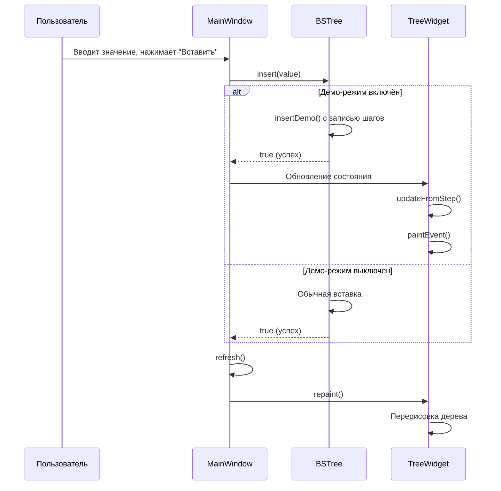

# UML-диаграмма классов проекта "Бинарное дерево поиска на Qt"

## Общая архитектура

Проект реализует паттерн **Model-View-Controller (MVC)**:
- **Model**: `BSTree` — модель данных бинарного дерева
- **View**: `TreeWidget` — компонент визуализации
- **Controller**: `MainWindow` — управление взаимодействием пользователя

---

## UML-диаграмма классов

```mermaid
classDiagram
    %% Структуры данных
    class Node {
        +char* data
        +Node* left
        +Node* right
        +Node(char* s)
    }

    class StepInfo {
        +QString description
        +QVector~const Node*~ highlightedNodes
        +QVector~const Node*~ modifiedNodes
        +const Node* currentNode
        +int operationType
    }

    %% Модель данных
    class BSTree {
        -Node* m_root
        -bool m_demoMode
        -int m_currentStep
        -QVector~StepInfo~ m_steps
        +BSTree()
        +~BSTree()
        +Node* root() const
        +void clear()
        +bool insert(const QString& value)
        +bool remove(const QString& value)
        +bool contains(const QString& value) const
        +int countStartsWith(QChar ch) const
        +int height() const
        +int countNodes() const
        +String preorder() const
        +String inorder() const
        +String postorder() const
        +String verticalPrint() const
        +String horizontalPrint() const
        +void balance()
        +void setDemoMode(bool enabled)
        +bool isDemoMode() const
        +void setCurrentStep(int step)
        +int currentStep() const
        +int totalSteps() const
        +const StepInfo& getStep(int index) const
        +void clearSteps()
        -static char* dupUtf8(const QString& s)
        -static String fromUtf8(const char* s)
        -static int cmp(const char* a, const QString& b)
        -static void destroy(Node* n)
        -static Node* insert(Node* n, const QString& value, bool& inserted)
        -static Node* remove(Node* n, const QString& value, bool& removed)
        -static Node* minNode(Node* n)
        -static bool contains(Node* n, const QString& value)
        -static void preorder(Node* n, QStringList& out)
        -static void inorder(Node* n, QStringList& out)
        -static void postorder(Node* n, QStringList& out)
        -static int height(Node* n)
        -static int countNodes(Node* n)
        -static int countStartsWith(Node* n, QChar ch)
        -static void collectInorder(Node* n, QVector~String~& vals)
        -static Node* buildBalanced(const QVector~String~& vals, int l, int r)
        -static void horizontalPrint(Node* n, int depth, QStringList& out)
        -void addStep(...)
        -Node* insertDemo(Node* n, const QString& value, bool& inserted)
        -Node* removeDemo(Node* n, const QString& value, bool& removed)
        -bool containsDemo(Node* n, const QString& value)
        -void balanceDemo()
    }

    %% Представление
    class TreeWidget {
        -BSTree* m_tree
        -QMap~const Node*, QPointF~ m_pos
        -bool m_demoMode
        -int m_currentStep
        -int m_totalSteps
        -QSet~const Node*~ m_highlightedNodes
        -QSet~const Node*~ m_modifiedNodes
        -const Node* m_currentNode
        -String m_stepDescription
        -int m_operationType
        +TreeWidget(QWidget* parent)
        +void setTree(BSTree* tree)
        +void setDemoMode(bool enabled)
        +void setCurrentStep(int step)
        +int currentStep() const
        +int totalSteps() const
        +stepChanged(int step)*
        +demoFinished()*
        #void paintEvent(QPaintEvent* event)
        #void resizeEvent(QResizeEvent* event)
        #void mousePressEvent(QMouseEvent* event)
        -void updateLayout()
        -void assignPos(...)
        -void drawEdges(QPainter& painter, const Node* node)
        -void drawNodes(QPainter& painter, const Node* node)
        -void updateFromStep()
    }

    %% Контроллер
    class MainWindow {
        -BSTree* m_tree
        -TreeWidget* m_treeWidget
        -QLineEdit* m_valueEdit
        -QLineEdit* m_prefixEdit
        -QTextEdit* m_output
        -QCheckBox* m_demoModeCheck
        -QPushButton* m_prevStepBtn
        -QPushButton* m_nextStepBtn
        -QPushButton* m_playBtn
        -QSlider* m_stepSlider
        -QLabel* m_stepLabel
        -bool m_isPlaying
        -int m_playTimerId
        +MainWindow(QWidget* parent)
        +~MainWindow()
        #void timerEvent(QTimerEvent* event)
        -void refresh()
        -void log(const String& text)
        -void setupDemoControls(QVBoxLayout* layout)
        -void updateDemoControls()
        -void goToNextStep()
        -void goToPrevStep()
        -void togglePlayPause()
        -void stopTimer()
    }

    %% Отношения
    BSTree "1" *-- "0..*" Node : содержит
    BSTree "1" *-- "0..*" StepInfo : хранит шаги
    TreeWidget "1" --> "1" BSTree : отображает
    MainWindow "1" --> "1" BSTree : управляет
    MainWindow "1" --> "1" TreeWidget : содержит
    TreeWidget --|> QWidget : наследует
    MainWindow --|> QMainWindow : наследует
```

---

## Разъяснение реализованных классов

### 1. Структура `Node` (Узел дерева)

**Назначение**: Базовый элемент бинарного дерева поиска.

**Атрибуты**:
- `data` (`char*`) — указатель на строку в кодировке UTF-8 (поддержка русских символов)
- `left` (`Node*`) — указатель на левого потомка
- `right` (`Node*`) — указатель на правого потомка

**Методы**:
- `Node(char* s)` — конструктор, инициализирующий данные узла

**Особенности**:
- Используется ручное управление памятью для строк
- Поддерживает хранение произвольных строковых значений

---

### 2. Структура `StepInfo` (Информация о шаге демонстрации)

**Назначение**: Хранение метаданных одного шага демонстрационного режима.

**Атрибуты**:
- `description` (`QString`) — текстовое описание выполняемого действия
- `highlightedNodes` (`QVector<const Node*>`) — узлы, которые должны быть подсвечены
- `modifiedNodes` (`QVector<const Node*>`) — узлы, которые были изменены на этом шаге
- `currentNode` (`const Node*`) — текущий обрабатываемый узел
- `operationType` (`int`) — тип операции:
  - `0` — нет операции
  - `1` — вставка (insert)
  - `2` — удаление (remove)
  - `3` — поиск (search)
  - `4` — балансировка (balance)

**Особенности**:
- Позволяет «отматывать» выполнение операций назад
- Используется для образовательной визуализации алгоритмов

---

### 3. Класс `BSTree` (Бинарное дерево поиска)

**Назначение**: Реализация модели данных бинарного дерева поиска с поддержкой демонстрационного режима.

**Атрибуты**:
- `m_root` (`Node*`) — корневой узел дерева
- `m_demoMode` (`bool`) — флаг включения демонстрационного режима
- `m_currentStep` (`int`) — индекс текущего шага демонстрации
- `m_steps` (`QVector<StepInfo>`) — история шагов выполнения операций

**Публичные методы**:

| Метод | Назначение |
|-------|------------|
| `BSTree()` | Конструктор по умолчанию |
| `~BSTree()` | Деструктор, освобождающий память |
| `root()` | Возвращает корневой узел |
| `clear()` | Очищает всё дерево |
| `insert(value)` | Вставляет элемент, возвращает успех |
| `remove(value)` | Удаляет элемент, возвращает успех |
| `contains(value)` | Проверяет наличие элемента |
| `countStartsWith(ch)` | Считает элементы, начинающиеся с символа |
| `height()` | Вычисляет высоту дерева |
| `countNodes()` | Подсчитывает количество узлов |
| `preorder()` | Прямой обход (корень-левый-правый) |
| `inorder()` | Симметричный обход (левый-корень-правый) |
| `postorder()` | Обратный обход (левый-правый-корень) |
| `verticalPrint()` | Вертикальное текстовое представление |
| `horizontalPrint()` | Горизонтальное текстовое представление |
| `balance()` | Балансирует дерево |
| `setDemoMode(enabled)` | Включает/выключает демо-режим |
| `isDemoMode()` | Проверяет статус демо-режима |
| `setCurrentStep(step)` | Устанавливает текущий шаг демонстрации |
| `currentStep()` | Возвращает текущий шаг |
| `totalSteps()` | Возвращает общее количество шагов |
| `getStep(index)` | Получает информацию о шаге |
| `clearSteps()` | Очищает историю шагов |

**Приватные статические методы**:
- Вспомогательные функции для работы с UTF-8 строками
- Рекурсивные реализации всех операций над деревом
- Методы сбора данных для балансировки

**Приватные методы демо-режима**:
- `addStep()` — добавление шага в историю
- `insertDemo()`, `removeDemo()`, `containsDemo()`, `balanceDemo()` — версии методов с записью шагов

**Алгоритмические особенности**:
- **Вставка**: O(log n) в среднем, запрещает дубликаты
- **Удаление**: O(log n) в среднем, корректно обрабатывает все три случая (лист, один потомок, два потомка)
- **Балансировка**: O(n), строит идеально сбалансированное дерево из отсортированного массива

---

### 4. Класс `TreeWidget` (Виджет отображения дерева)

**Назначение**: Графическая отрисовка бинарного дерева в реальном времени.

**Наследование**: `QWidget`

**Атрибуты**:
- `m_tree` (`BSTree*`) — ссылка на отображаемое дерево
- `m_pos` (`QMap<const Node*, QPointF>`) — кэш координат узлов
- `m_demoMode` (`bool`) — флаг демонстрационного режима
- `m_currentStep` (`int`) — текущий шаг демонстрации
- `m_totalSteps` (`int`) — общее количество шагов
- `m_highlightedNodes` (`QSet<const Node*>`) — множество подсвеченных узлов
- `m_modifiedNodes` (`QSet<const Node*>`) — множество модифицированных узлов
- `m_currentNode` (`const Node*`) — текущий узел операции
- `m_stepDescription` (`QString`) — описание текущего шага
- `m_operationType` (`int`) — тип текущей операции

**Публичные методы**:
- `TreeWidget(parent)` — конструктор
- `setTree(tree)` — устанавливает дерево для отображения
- `setDemoMode(enabled)` — включает демонстрационный режим
- `setCurrentStep(step)` — переходит к указанному шагу
- `currentStep()`, `totalSteps()` — информация о прогрессе

**Сигналы**:
- `stepChanged(step)` — испускается при изменении шага
- `demoFinished()` — испускается по завершении демонстрации

**Защищённые методы** (переопределённые):
- `paintEvent(event)` — отрисовка виджета
- `resizeEvent(event)` — обработка изменения размера
- `mousePressEvent(event)` — обработка кликов мыши

**Приватные методы**:
- `updateLayout()` — пересчёт позиций всех узлов
- `assignPos(...)` — рекурсивное размещение узлов по уровням
- `drawEdges(painter, node)` — отрисовка связей между узлами
- `drawNodes(painter, node)` — отрисовка узлов с подсветкой
- `updateFromStep()` — обновление состояния из текущего шага

**Особенности визуализации**:
- Автоматическое вычисление координат на основе глубины узла
- Цветовая индикация: обычные узлы, подсвеченные, модифицированные
- Отрисовка линий-рёбер между родителями и потомками

---

### 5. Класс `MainWindow` (Главное окно приложения)

**Назначение**: Контроллер приложения, управление пользовательским интерфейсом и взаимодействие с моделью.

**Наследование**: `QMainWindow`

**Атрибуты**:
- `m_tree` (`BSTree*`) — экземпляр дерева
- `m_treeWidget` (`TreeWidget*`) — виджет отображения
- `m_valueEdit` (`QLineEdit*`) — поле ввода значения
- `m_prefixEdit` (`QLineEdit*`) — поле ввода префикса
- `m_output` (`QTextEdit*`) — область вывода результатов
- `m_demoModeCheck` (`QCheckBox*`) — переключатель демо-режима
- `m_prevStepBtn`, `m_nextStepBtn` — кнопки навигации по шагам
- `m_playBtn` — кнопка воспроизведения/паузы
- `m_stepSlider` (`QSlider*`) — слайдер для быстрой навигации
- `m_stepLabel` (`QLabel*`) — метка текущего шага
- `m_isPlaying` (`bool`) — статус воспроизведения
- `m_playTimerId` (`int`) — идентификатор таймера

**Публичные методы**:
- `MainWindow(parent)` — конструктор, инициализирующий UI
- `~MainWindow()` — деструктор

**Защищённые методы**:
- `timerEvent(event)` — обработка событий таймера для авто-воспроизведения

**Приватные методы**:
- `refresh()` — обновление интерфейса после изменений
- `log(text)` — добавление текста в область вывода
- `setupDemoControls(layout)` — настройка элементов управления демо-режимом
- `updateDemoControls()` — обновление состояния контролов
- `goToNextStep()`, `goToPrevStep()` — навигация по шагам
- `togglePlayPause()` — переключение воспроизведения
- `stopTimer()` — остановка таймера

**Функциональность**:
- Обработка всех пользовательских действий
- Связывание модели (`BSTree`) и представления (`TreeWidget`)
- Управление демонстрационным режимом
- Вывод результатов операций в текстовом виде

---

## Диаграмма последовательности для операции вставки

---

## Отношения между классами

| Отношение | Классы | Тип | Описание |
|-----------|--------|-----|----------|
| Наследование | `TreeWidget` → `QWidget` | Is-a | Виджет является GUI-компонентом Qt |
| Наследование | `MainWindow` → `QMainWindow` | Is-a | Главное окно является окном Qt |
| Агрегация | `BSTree` → `Node` | Has-a | Дерево содержит узлы |
| Композиция | `BSTree` → `StepInfo` | Owns-a | Дерево владеет историей шагов |
| Ассоциация | `TreeWidget` → `BSTree` | Uses | Виджет отображает дерево |
| Ассоциация | `MainWindow` → `BSTree` | Uses | Контроллер управляет деревом |
| Ассоциация | `MainWindow` → `TreeWidget` | Contains | Контроллер содержит виджет |

---

## Заключение

Данный проект демонстрирует:
1. ✅ Применение ООП принципов (инкапсуляция, наследование, полиморфизм)
2. ✅ Использование паттерна MVC для разделения ответственности
3. ✅ Реализацию фундаментальной структуры данных (BST)
4. ✅ Интерактивную визуализацию алгоритмов
5. ✅ Поддержку современного GUI-фреймворка Qt
6. ✅ Образовательный демонстрационный режим с пошаговой анимацией

Архитектура проекта обеспечивает лёгкость расширения, тестирования и сопровождения кода.
